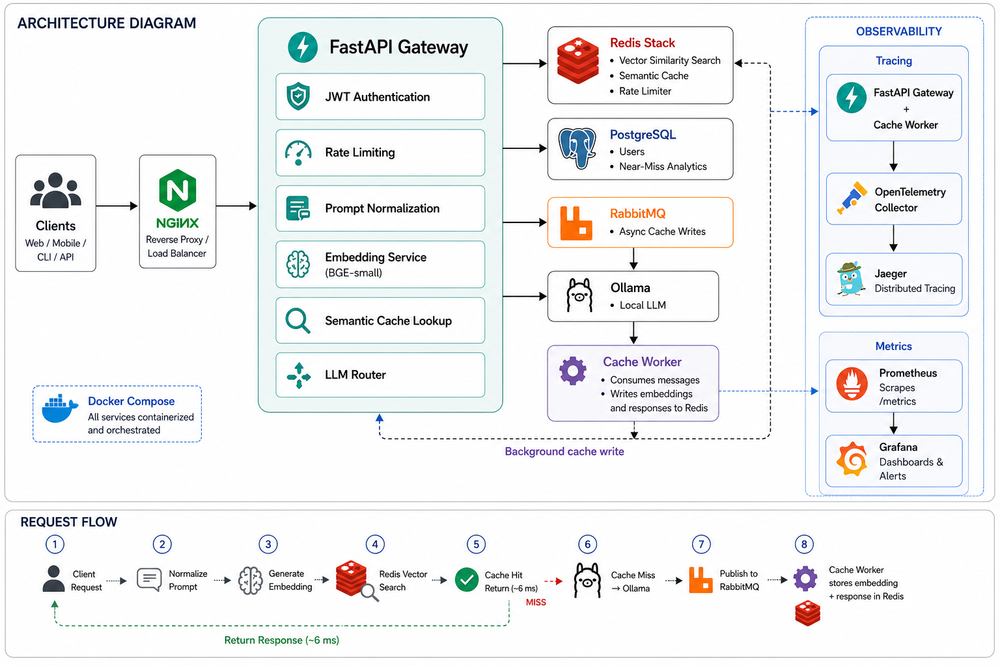

# Semantic Cache LLM Gateway

A production-grade API gateway that sits in front of any LLM and serves cached responses using vector similarity search. Instead of exact string matching, it understands meaning — "What is ML?" and "Explain machine learning to me" return the same cached response.

Built from scratch as a learning project covering distributed systems, async Python, observability, and load testing.

---

## What It Does

Every LLM query goes through the gateway. On a cache hit, the response is served from Redis in **~6ms** instead of the **20–30 seconds** a local LLM call takes — a ~400x latency reduction.

```
Client → nginx → Gateway → Redis vector search → cache hit  → 6ms response
                                               → cache miss → LLM → 20-30s response
                                                                  → write to cache (async)
```

Cache writes are decoupled from the request path. After an LLM response, the gateway publishes to RabbitMQ and returns immediately. A background worker handles the Redis write independently.

---

## Architecture



```
                          ┌─────────────────────────────────────────────┐
                          │              Docker Network                  │
                          │                                              │
Client ──► nginx:8000 ──► │ gateway (FastAPI)                           │
                          │   │                                          │
                          │   ├──► postgres:5432  (users, near-misses)  │
                          │   ├──► redis:6379     (vector cache, rate   │
                          │   │                    limiting)            │
                          │   ├──► rabbitmq:5672  (async cache writes)  │
                          │   ├──► ollama (host)  (LLM inference)       │
                          │   └──► otel-collector (traces)              │
                          │                                              │
                          │ worker                                       │
                          │   └──► rabbitmq → redis (cache writes)      │
                          │                                              │
                          │ prometheus ──► grafana:3000                  │
                          │ otel-collector ──► jaeger:16686              │
                          └─────────────────────────────────────────────┘
```

**Components:**

| Component | Role |
|---|---|
| nginx | Load balancer, single entry point |
| FastAPI gateway | Auth, rate limiting, embedding, cache lookup, LLM routing |
| Redis (redis-stack) | Vector similarity search, rate limit state |
| RabbitMQ | Async queue between gateway and cache worker |
| Cache worker | Consumes queue, writes embeddings to Redis |
| Postgres | User accounts, near-miss analytics |
| Prometheus + Grafana | Metrics and dashboards |
| OTel Collector + Jaeger | Distributed tracing |
| Ollama | Local LLM inference (llama3.2) |

---

## Performance

Benchmarks from Phase 5 load testing (20 concurrent users, MacBook Air, local Ollama):

| Metric | Before optimization | After optimization |
|---|---|---|
| P50 latency | 1,600ms | **6ms** |
| P95 latency | 5,500ms | **160ms** |
| Throughput | 8 RPS | **57 RPS** |

**Bottleneck found and fixed:** The sentence-transformer embedding model was being called synchronously inside the async event loop, blocking all concurrent requests. Fixed by offloading to a thread pool (`run_in_executor`) and adding `lru_cache` to skip the model entirely for repeated prompts.

**Chaos testing results:**

| Component killed | Impact |
|---|---|
| Cache worker | Zero — write path is decoupled, reads unaffected |
| RabbitMQ | Zero on reads — only new cache writes fail |
| Redis | Full outage — rate limiter is first Redis call, everything hangs |

---

## Tech Stack

- **FastAPI** — async Python web framework
- **sentence-transformers** (`BAAI/bge-small-en-v1.5`) — 384-dim embeddings
- **redisvl** — vector similarity search on Redis
- **RabbitMQ** (aio-pika) — async message queue
- **Postgres** (SQLAlchemy async + asyncpg) — user data and analytics
- **Alembic** — database migrations
- **JWT** — stateless auth (python-jose + bcrypt)
- **Prometheus** (prometheus-client) — metrics
- **OpenTelemetry** — distributed tracing → Jaeger
- **Grafana** — pre-provisioned dashboard (zero setup)
- **Locust** — load testing
- **Docker Compose** — full stack orchestration

---

## Running Locally

### Prerequisites

- Docker + Docker Compose
- [Ollama](https://ollama.ai) installed and running on the host
- `ollama pull llama3.2` (or any model — update `LLM_MODEL` in `llm.py`)

### Start

```bash
docker compose up --build
```

All services start automatically. Grafana dashboard is pre-provisioned — no manual setup.

### Create a user

```bash
curl -X POST http://localhost:8000/auth/register \
  -H "Content-Type: application/json" \
  -d '{"email": "you@example.com", "password": "yourpassword"}'
```

### Get a token

```bash
curl -X POST http://localhost:8000/auth/login \
  -H "Content-Type: application/json" \
  -d '{"email": "you@example.com", "password": "yourpassword"}'
```

### Query the gateway

```bash
curl -X POST http://localhost:8000/query/ \
  -H "Authorization: Bearer <token>" \
  -H "Content-Type: application/json" \
  -d '{"prompt": "What is machine learning?"}'
```

Response includes `cache_hit: true/false` so you can see the cache working.

---

## API Endpoints

| Method | Endpoint | Description |
|---|---|---|
| `POST` | `/auth/register` | Create a user account |
| `POST` | `/auth/login` | Get a JWT token |
| `POST` | `/query/` | Send a prompt, get a response |
| `DELETE` | `/cache/invalidate` | Invalidate a cached entry |
| `GET` | `/cache/near-misses` | View recent near-miss queries |
| `GET` | `/cache/threshold-analysis` | Analyze what hit rate different thresholds would give |
| `GET` | `/metrics` | Prometheus metrics endpoint |

---

## Observability

| Tool | URL | Credentials |
|---|---|---|
| Grafana | http://localhost:3000 | admin / admin |
| Jaeger | http://localhost:16686 | — |
| Prometheus | http://localhost:9090 | — |
| RabbitMQ Management | http://localhost:15672 | guest / guest |

Grafana dashboard shows: cache hit rate, P50/P95 latency, active requests, queue depth, similarity score distribution, LLM call rate.

---

## Load Testing

```bash
pip install locust
locust -f locustfile.py --host http://localhost:8000
```

Open http://localhost:8089 for the Locust UI, or run headless:

```bash
locust -f locustfile.py --host http://localhost:8000 \
  --headless --users 20 --spawn-rate 5 --run-time 5m
```

Create the test user first (email: `testuser@test.com`, password: `testpassword`).

---

## How Semantic Caching Works

1. Incoming prompt is normalized (lowercase, filler phrases removed, whitespace collapsed)
2. Normalized prompt is embedded into a 384-dimensional vector using `BAAI/bge-small-en-v1.5`
3. Redis performs approximate nearest-neighbor search across all cached vectors
4. If the closest match has cosine distance < 0.15 (similarity > 0.85), return the cached response
5. Otherwise, call the LLM and publish the result to RabbitMQ for async cache write

The threshold (0.15 distance / 0.85 similarity) is tunable. `/cache/threshold-analysis` shows what the hit rate would be at different thresholds based on observed traffic.

---

## Project Structure

```
backend/
  api/          ← route handlers (query, auth, cache)
  core/         ← auth, rate limiting, tracing, metrics, deduplication
  services/     ← embedding, cache search, LLM, queue, normalizer
  models/       ← SQLAlchemy table definitions
  schemas/      ← Pydantic request/response shapes
  db/           ← database connection
  workers/      ← RabbitMQ cache write consumer
  main.py
migrations/     ← Alembic migration files
grafana/        ← pre-provisioned dashboard and datasource
locustfile.py   ← load test
docker-compose.yml
nginx.conf
prometheus.yml
```
