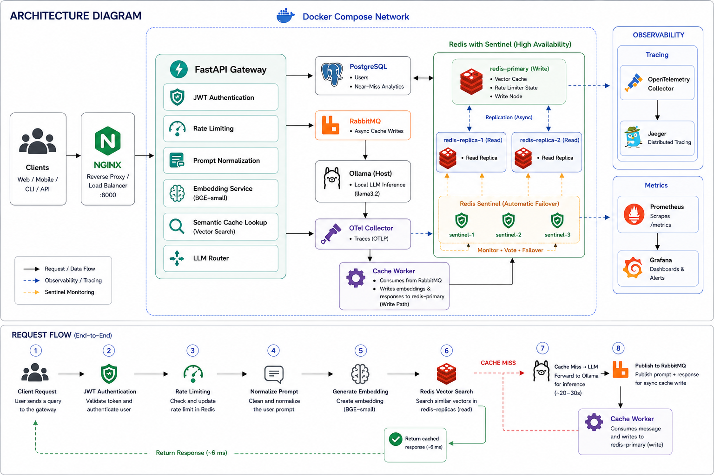

# Semantic Cache LLM Gateway

An API gateway that sits in front of any LLM provider and serves semantically cached responses. Clients submit natural-language prompts; the gateway embeds the query, searches for a similar cached response, and either returns it in ~6ms or calls the LLM and writes the response to cache asynchronously — transparently, with no client changes required.

---

## System Architecture



**Request flow:**
1. Client sends a prompt → nginx routes to the FastAPI gateway
2. Gateway authenticates JWT and checks rate limit against Redis
3. Prompt is normalized (lowercase, filler phrases stripped) and embedded into a 384-dim vector
4. Redis performs nearest-neighbor search — if cosine similarity > 0.85, cache hit → respond in ~6ms
5. On a miss, gateway calls Ollama and streams the response to the client immediately
6. Gateway publishes the prompt + response to RabbitMQ; cache worker writes the embedding to Redis asynchronously — decoupled from the request path
7. Redis Sentinel monitors the primary across 3 processes — on failure, a replica is promoted in ~7s; a circuit breaker opens after 3 consecutive Redis errors so traffic degrades gracefully instead of hanging

---

## Features

- **Semantic similarity matching** — "What is ML?" and "Explain machine learning to me" hit the same cache entry; cosine distance threshold is tunable via `/cache/threshold-analysis`
- **~400x latency reduction on cache hits** — ~6ms from Redis vs 20–30s from a local LLM; P50 drops from 1,600ms to 6ms after warmup
- **Async cache writes** — the gateway returns to the client the moment the LLM responds; RabbitMQ decouples the Redis write so it never blocks a request
- **Redis high availability** — 3 Sentinel processes with quorum voting; read replicas serve cache lookups during the primary failover window; automatic recovery with no manual intervention
- **Circuit breaker + fail-open rate limiter** — opens after 3 Redis failures in under 1.5s; rate limiter fails open so requests continue rather than 429 during a Redis outage
- **Streaming** — cache misses stream tokens from Ollama to the client via SSE; buffer-and-forward publishes the complete response to RabbitMQ after the stream ends
- **OpenAI-compatible endpoint** — `/v1/chat/completions` accepts the exact OpenAI request and response format; swap the base URL, zero client code changes
- **Near-miss analytics** — queries that narrowly missed the similarity threshold are stored in Postgres; replay them against any threshold to find the accuracy/hit-rate tradeoff
- **Cache invalidation** — manual invalidation by entry or system-prompt hash; TTL-based expiry on all entries
- **Distributed tracing** — OpenTelemetry → Jaeger; every request traced end-to-end across gateway, embedding, cache lookup, and LLM call
- **Prometheus + Grafana** — pre-provisioned dashboard (zero setup); tracks cache hit rate, P50/P95 latency, LLM call rate, queue depth, and similarity score distribution

---

## Stack

| Layer | Technology |
|---|---|
| API | Python 3.11, FastAPI, SQLAlchemy (async) |
| Database | PostgreSQL 16 |
| Cache / vector store | Redis 7 + RedisVL, Redis Sentinel (HA) |
| Message queue | RabbitMQ (aio-pika) |
| Embeddings | sentence-transformers (`BAAI/bge-small-en-v1.5`) — local, zero cost |
| LLM inference | Ollama (`llama3.2`) — local, zero cost |
| Auth | JWT (python-jose + bcrypt) |
| Observability | Prometheus, Grafana, OpenTelemetry, Jaeger |
| Load testing | Locust |
| Infra | Docker Compose (12 services) |

---

## Running Locally

**Prerequisites:** Docker Desktop, Ollama running locally with the model pulled:

```bash
ollama pull llama3.2
```

### Docker (recommended)

```bash
git clone https://github.com/tejasmhadgut/semantic-cache-llm-gateway.git
cd semantic-cache-llm-gateway
docker compose up --build
```

All services start automatically. Grafana is pre-provisioned — no manual setup.

| Service | URL | Credentials |
|---|---|---|
| Gateway API | http://localhost:8000 | — |
| Grafana | http://localhost:3000 | admin / admin |
| Jaeger | http://localhost:16686 | — |
| Prometheus | http://localhost:9090 | — |
| RabbitMQ Management | http://localhost:15672 | guest / guest |

### First steps

```bash
# Create a user
curl -X POST http://localhost:8000/auth/register \
  -H "Content-Type: application/json" \
  -d '{"email": "you@example.com", "password": "yourpassword"}'

# Get a token
curl -X POST http://localhost:8000/auth/login \
  -H "Content-Type: application/json" \
  -d '{"email": "you@example.com", "password": "yourpassword"}'

# Query the gateway
curl -X POST http://localhost:8000/query/ \
  -H "Authorization: Bearer <token>" \
  -H "Content-Type: application/json" \
  -d '{"prompt": "What is machine learning?"}'
```

Every response includes `cache_hit: true/false`.

### Load testing

```bash
pip install locust
locust -f locustfile.py --host http://localhost:8000 \
  --headless --users 20 --spawn-rate 5 --run-time 5m
```

Create the test user first (`testuser@test.com` / `testpassword`).

---

## API Endpoints

| Method | Endpoint | Description |
|---|---|---|
| `POST` | `/auth/register` | Create a user account |
| `POST` | `/auth/login` | Get a JWT token |
| `POST` | `/query/` | Send a prompt, get a cached or LLM response |
| `POST` | `/v1/chat/completions` | OpenAI-compatible endpoint |
| `DELETE` | `/cache/invalidate` | Invalidate a cached entry |
| `GET` | `/cache/near-misses` | View recent near-miss queries |
| `GET` | `/cache/threshold-analysis` | Hit rate at different similarity thresholds |
| `GET` | `/metrics` | Prometheus metrics |

---

## Project Structure

```
backend/
  api/          ← route handlers (query, auth, cache, openai-compat)
  core/         ← auth, rate limiting, circuit breaker, tracing, metrics, deduplication
  services/     ← embedding, cache search, LLM, queue, normalizer, redis client
  models/       ← SQLAlchemy table definitions
  schemas/      ← Pydantic request/response shapes
  db/           ← database connection
  workers/      ← RabbitMQ cache write consumer
  main.py
migrations/     ← Alembic migration files
grafana/        ← pre-provisioned dashboard and datasource
locustfile.py   ← load test
docker-compose.yml
nginx.conf
prometheus.yml
```

---

## Key Design Decisions

**Why RabbitMQ instead of writing to Redis directly from the gateway?**
Cache writes require computing embeddings and updating vector indices — that's 50–200ms of work. Doing it synchronously would add that cost to every cache-miss response. RabbitMQ decouples the write entirely: the gateway responds as soon as the LLM does, and the cache worker processes the queue independently. It also means a Redis write failure never impacts a client response.

**Why Redis Sentinel instead of a single Redis instance?**
During chaos testing without HA, a killed Redis node caused full gateway outage — 0 RPS, 39-second hangs with no recovery until restart. Sentinel with 3 monitors and quorum voting reduces that to ~7s automatic failover with 1.18% request failure rate across 1,696 requests. The replica topology also lets read-heavy cache lookups continue on replicas during the primary failover window.

**Why a circuit breaker on top of Sentinel?**
Sentinel handles failover but there's still a ~7s window where Redis is unreachable. Without a circuit breaker, every in-flight Redis call hangs until socket timeout (500ms each), causing a pile-up that saturates the gateway thread pool. The circuit breaker opens after 3 consecutive failures and fast-fails all Redis calls for 5s — the gateway degrades gracefully to LLM-only mode instead of hanging.

**Why fail-open on the rate limiter?**
Rate limiting is a Redis-dependent feature. If Redis is down and the rate limiter throws, we have two choices: return 429 to all users (fail closed) or skip rate limiting and let the request through (fail open). During a Redis outage, denying all traffic compounds the incident. Fail open keeps the service available; the blast radius of temporarily unenforced rate limits is much smaller than a full outage.

**Why buffer-and-forward for streaming cache writes?**
Streaming sends tokens to the client as they arrive, but cache storage needs the complete response. The solution is to accumulate tokens in a buffer while yielding them to the client simultaneously, then publish the full string to RabbitMQ after the stream ends. This preserves streaming latency for the client while still writing a coherent response to cache.

**Why sentence-transformers locally instead of the OpenAI embeddings API?**
Zero cost, zero API key, no external network call on every request. `BAAI/bge-small-en-v1.5` produces 384-dim vectors with strong semantic quality for general queries. The only tradeoff is a cold-start model load (~2s at startup). The architecture is model-agnostic — swapping to OpenAI embeddings is a one-line change in the embedding service.
